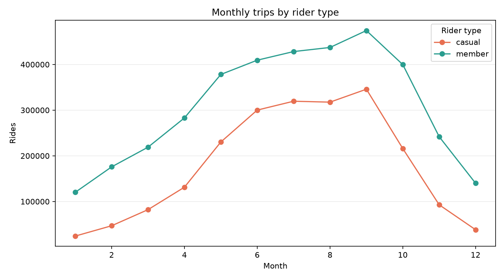
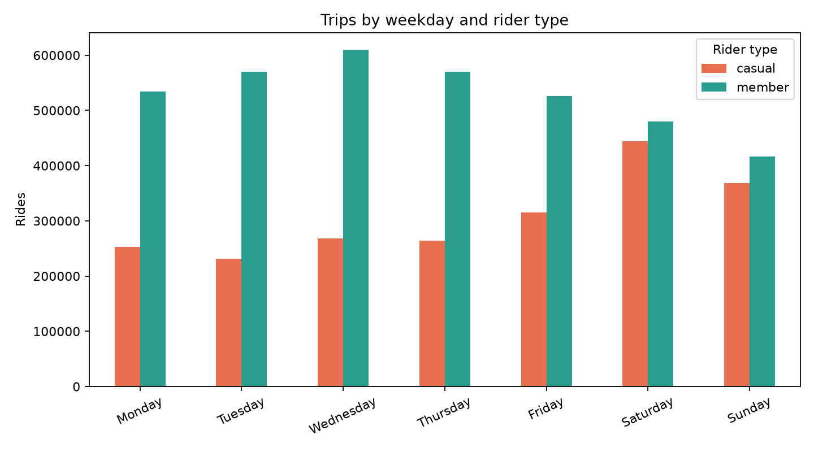
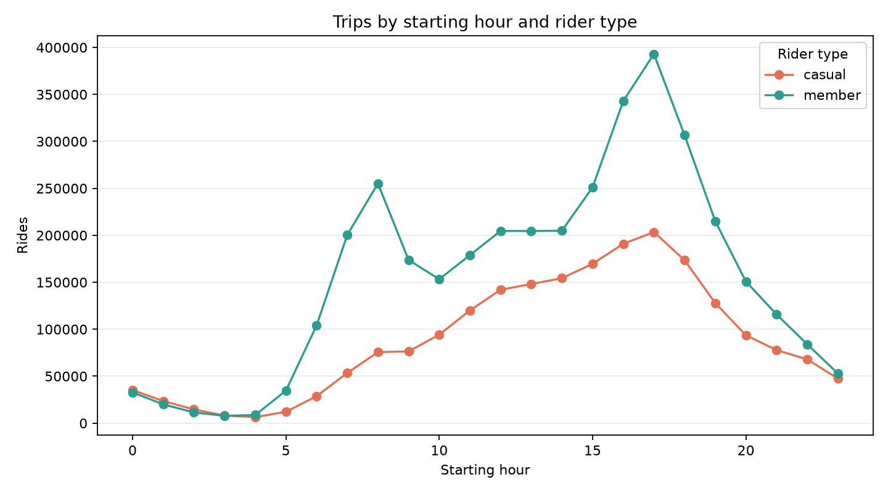
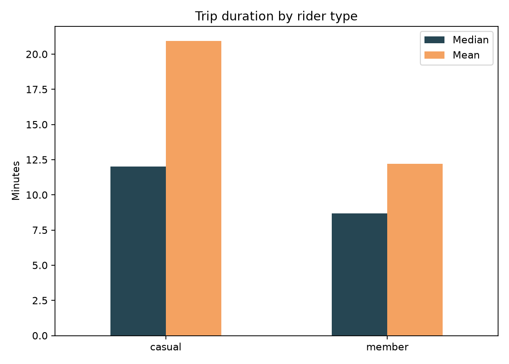

# Chicago Bike-Share Analysis

A reproducible analysis of 5.86 million Divvy trips from 2024. The project uses DuckDB to process the complete public dataset without loading every source file into memory, validates data quality explicitly, and publishes the resulting tables and charts.

## Results

After validation, the analysis retains **5,852,081 rides**. Members account for **63.34%** of rides, while casual riders account for **36.66%**. Casual trips are longer: the median is **12.02 minutes**, compared with **8.68 minutes** for members.



Both groups reach their monthly high in September. Their weekly patterns differ: casual ridership peaks on Saturday, while member ridership peaks on Wednesday.



Member activity has pronounced commute-hour peaks. Casual activity rises more gradually through the afternoon, supporting—but not proving—a stronger leisure-use pattern.





The complete findings, limitations, and recommendations are in [artifacts/analysis.md](artifacts/analysis.md). Machine-readable aggregate tables are available under [`artifacts/tables`](artifacts/tables).

## Data-quality decisions

The pipeline appends the 12 monthly extracts because they contain the same fields; it does not join them. It then:

- validates the required schema;
- excludes missing ride IDs, unsupported rider types, invalid timestamps, trips outside 2024, non-positive durations, and durations over 24 hours;
- keeps one eligible record for each duplicate ride ID; and
- retains rides with missing station metadata for membership, time, duration, and bike-type analysis, excluding them only from station and route rankings.

This treatment matters: **1,652,259 rows** lack complete station metadata. Removing them globally would bias all non-station results. Quality categories can overlap, so their counts should not be subtracted independently from the raw total.

## Reproduce the analysis

Python 3.11 or newer is recommended.

```bash
python -m venv .venv
# Windows: .venv\Scripts\activate
# macOS/Linux: source .venv/bin/activate
pip install -r requirements.txt
python run_analysis.py --download
```

The command downloads the 12 official 2024 ZIP archives, extracts only their trip CSVs to `data/raw`, and rebuilds every artifact. Raw data is intentionally excluded from Git because it is over 1 GB uncompressed and remains subject to the source data license.

To use files that are already present:

```bash
python run_analysis.py --raw-dir data/raw --output-dir artifacts
```

Run the automated checks with:

```bash
pip install -r requirements-dev.txt
ruff check .
pytest -q
```

## Project structure

```text
bikeshare_analysis/
  download.py          Official archive downloader and safe ZIP extraction
  pipeline.py          Validation, aggregation, reporting, and visualization
notebooks/
  analysis.ipynb       Short interactive entry point using the same pipeline
tests/                  Downloader and analysis tests
artifacts/
  analysis.md          Generated findings and limitations
  quality_summary.json Generated validation counts
  tables/              Reusable aggregate CSVs
  figures/             Generated charts
run_analysis.py        Command-line entry point
```

## Data source and scope

The source is the [Divvy trip-data archive](https://divvy-tripdata.s3.amazonaws.com/index.html), documented on the [Divvy system-data page](https://divvybikes.com/system-data). Divvy states that published files are processed to remove staff service trips and trips shorter than 60 seconds. Use of the data is governed by the [Divvy Data License Agreement](https://divvybikes.com/data-license-agreement).

The records describe trips, not identifiable riders. They cannot show whether multiple trips came from one person, whether a casual rider later subscribed, or why a trip occurred. Recommendations in this repository are therefore testable business hypotheses, not causal claims.

## License

The project code is released under the [MIT License](LICENSE). The source trip data retains its original terms.
